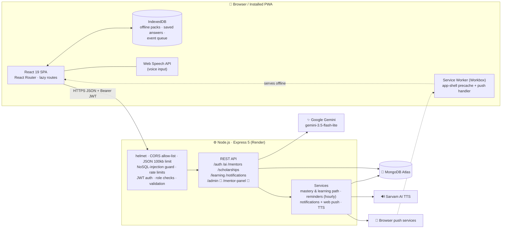

# ShikshaSetu — Hackathon Context File

> **Purpose:** Source of truth for writing the hackathon documents and jury pitch.
> Everything below was verified against the source code on **30 Sep 2026** (git `main` @ `3ef650c` + uncommitted work noted below).
>
> **Rules for the writer:**
> - Claim only what is marked ✅. Describe 🟡 items honestly as prototype/demo. Present ⏳ items only as future roadmap.
> - Every `❓ ASK USER` item is still unknown. Do not guess these.
>
> **Status legend:**
> - ✅ **Working**: implemented end-to-end with real data or real API calls
> - 🟡 **Partial / mocked / hardcoded**: works, but uses demo data, static content or has a real gap
> - ⏳ **Planned**: not in the code at all
> - 🧪 **Built locally, not yet deployed**: code exists and is tested locally, but it is **uncommitted** and not on the live site

---

## ⚠️ Current repository state (read first)

| Item | State |
|---|---|
| Latest commit on `main` / `origin/main` | `3ef650c feat: improve mentor and career workflows` |
| **Uncommitted, not deployed** | Admin Panel, Mentor Panel, role-based fix on the Mentors page, role-based login redirect (files listed in §4 under 🧪) |
| Live frontend | **https://shiksha-setu-ai-six.vercel.app/** (Vercel) |
| Live backend | `https://shikshasetu-ai-5.onrender.com` (Render **free plan**) |

---

## 1. Project overview

- **Name:** ShikshaSetu AI (*Shiksha* = education, *Setu* = bridge)
- **One-line pitch:** A multilingual, offline-first, AI-powered learning platform that brings tutoring, mentors, scholarships and career guidance to rural and Tier-2/3 Indian students in their own language.

**What it does:**
- Students learn subject lessons, take quizzes and follow an adaptive 7-day learning path. Mastery is computed from their own quiz scores.
- An AI Tutor powered by Google Gemini answers doubts in any of 8 Indian languages, by text or by voice. The spoken answer uses Sarvam AI text-to-speech.
- "Sarthi" is a floating AI assistant that knows which page the student is on, for example "Am I eligible for this scholarship?"
- The app is an installable PWA. Lessons, quizzes and AI answers can be saved on the device and used offline. Learning activity recorded offline is queued and synced automatically when the internet returns.
- Students can find mentors and send requests, match scholarships against their own profile, track deadlines with reminders, and generate an AI career roadmap.

---

## 2. Problem statement

**Problem (as stated in the code and docs):**
- The PWA manifest describes the app as an *"inclusive digital learning platform for rural and tribal students"* (`frontend/vite.config.js`).
- The AI prompt says *"for rural and tribal students"* (`backend/src/controllers/ai.controller.js`).
- `PROJECT_EXPLANATION.md` lists four problems:
  1. **Language barrier**: quality content is mostly in English
  2. **Low or unreliable internet**
  3. **Lack of guidance and mentorship**
  4. **Lack of awareness** of scholarships and career paths

**Who suffers:** school and early-college students in rural, tribal and Tier-2/3 regions of India who study in regional languages and have limited connectivity and limited access to mentors or counsellors.

**Hackathon details (from the team's registration page):**

| Field | Value |
|---|---|
| Hackathon | **MPOnline Idea & Innovation Hackathon 2026** |
| Organiser | MPOnline Limited |
| Round | First Selection Round |
| Innovation category | **Technical** |
| Challenge / theme | **Digital Inclusion for Rural Higher Education** |
| Team | **Team ShikshaSetu** (3 members), registered 28 Sep 2026 |
| PS ID | ❓ ASK USER: the registration page shows only the theme name and a booking ID, not a PS ID. Is there a separate PS ID? |

**Official problem statement (verbatim from the hackathon site):**

> **Background:** Students from rural and tribal regions often face challenges such as limited internet connectivity, language barriers, lack of career awareness, and limited access to quality educational resources.
>
> **The Challenge:** Develop an innovative platform that enables inclusive digital learning through features such as: offline-first learning; regional language support; AI-powered doubt resolution; voice-based interaction; low-bandwidth optimization; government scholarship discovery; digital mentoring; career counseling.

**How ShikshaSetu covers each required feature (use this mapping in every document):**

| Required by PS | ShikshaSetu status | Where / notes |
|---|---|---|
| Offline-first learning | ✅ | PWA app-shell precache, offline subject packs, saved AI answers, offline quiz retakes, offline event queue + auto-sync (§4.4) |
| Regional language support | ✅ AI features / 🟡 static content | 8 languages for AI Tutor, Explain, Sarthi, AI questions and voice. Lessons, quizzes, UI labels and the career roadmap are English (§4.3). |
| AI-powered doubt resolution | ✅ | AI Tutor, "Explain it my way", Sarthi assistant (Gemini) (§4.2) |
| Voice-based interaction | ✅ | Voice input (Web Speech API; best in Chrome/Edge) + Sarvam TTS voice output in 8 languages, and a hands-free Voice Learning mode (§4.3) |
| Low-bandwidth optimization | ✅ | Code splitting, precached shell, long-cache hashed assets, chunked TTS, AI timeouts, idempotent batched sync (§11) |
| Government scholarship discovery | ✅ features / 🟡 data | Search, explainable eligibility match, tracking, deadline reminders all work, but the **DB holds 3 demo scholarships**, not real government schemes. There is no government API integration yet. |
| Digital mentoring | ✅ / 🟡 | Mentor discovery + request/accept flow + notifications. No chat or video after connecting. Mentors are demo profiles. 🧪 Mentor Panel with student progress and reminders. |
| Career counseling | ✅ (English only) | AI career roadmap + visual journey + Sarthi career context (§4.2) |

**⚠️ Theme vs content gap:** the theme says *Rural **Higher** Education*, but the built-in lessons (e.g. Number System, Algebra, Percentage, Computer Basics, Grammar) and AI prompts target **school-level** students. Career guidance and scholarships fit higher education: the scholarship profile form offers College, Undergraduate and Postgraduate levels, and the demo scholarships cover Class 11, Class 12 and College. The document writer should present the platform as covering the school → higher-education transition, and list college-level content as roadmap. ❓ ASK USER: Do you want to position it this way?

---

## 3. Target users & roles

The role is stored in `User.role`, which accepts `student`, `mentor` or `admin` (`backend/src/models/user.model.js`).

| Role | How the account is created | What they can do |
|---|---|---|
| 🎒 **Student** | Self sign-up at `/register`. The UI always sends `role: "student"`. | Learn lessons, take quizzes, follow the learning path, use the AI Tutor, voice learning and Sarthi, download offline packs, see progress and streak, browse mentors and send requests, match, track and get reminders for scholarships, generate a career roadmap, receive notifications. **Only students can send mentor requests** (the API enforces this). |
| 🧑‍🏫 **Mentor** | Created by the seed script (`npm run seed:mentors`). The register API also accepts `role: "mentor"`, but **the UI has no mentor sign-up option**. | ✅ See incoming requests and accept or reject them on `/mentors`. ✅ Edit their own profile. 🧪 Mentor Panel (`/mentor-panel`): dashboard stats, "My Students" with each accepted student's progress, reminders to students, availability toggle. A mentor only sees students whose request they accepted. |
| 🛡️ **Admin** | Only directly in the database. Self sign-up as admin is blocked: any role other than "mentor" becomes "student". | ✅ Edit any mentor's profile. ✅ Seed endpoints work in production. 🧪 Admin Panel (`/admin`): platform overview, per-student progress, mentor performance, change roles (student ↔ mentor), manage scholarships, send announcements. |
| 👤 **Guest** | Not logged in | Browse pages. AI Tutor, Career roadmap, "Explain again" and text-to-speech are open to guests with tighter rate limits. The mentor list hides email addresses from guests. |

---

## 4. Complete feature list

### 4.1 Learning

| Feature | Status | Details | Files |
|---|---|---|---|
| Subject lessons | 🟡 | 4 subjects (Mathematics, Science, Computer, English) × 5 topics = **20 lessons**. Each has an explanation, key points and an example. **The content is static, hardcoded and English only.** | `frontend/src/data/lessonLibrary.js`, `pages/Learning.jsx`, `pages/Lesson.jsx` |
| Lesson quiz | 🟡 | **20 hardcoded MCQs** (5 per subject). Scores are saved as learning events. | `lessonLibrary.js` (`testQuestions`), `Lesson.jsx` |
| Learning-progress bars | ✅ | Real: share of each subject's topics whose lesson is completed | `Learning.jsx`, `/api/learning/summary` |
| **Mastery engine** | ✅ | Per-topic mastery = weighted average of the **5 most recent** quiz/diagnostic/practice attempts (newest counts most). Bands: ≥70 strong, ≥50 improving, <50 needs practice. Completing a lesson never raises mastery by itself. | `backend/src/services/learning.service.js` |
| **Adaptive 7-day learning path** | ✅ | Rule-based plan: weak topics → lesson + practice; unassessed topics → lesson; improving → practice; strong → revision; day 7 = assessment. It is recomputed after every quiz. | `learning.service.js` (`buildPath`), `pages/LearningPath.jsx` |
| AI diagnostic / practice questions | ✅ | Gemini generates MCQs per subject and topic in the chosen language. The server validates that there are 4 options, exactly 1 answer, and the topic is in the catalogue. Questions are **cached for offline retakes**. Login required. | `aiAssist.controller.js` (`generateQuestions`), `LearningPath.jsx` |
| Streak + weekly mission | ✅ | Day streak, 7-day activity strip, weekly target of 4 lessons and 2 quizzes, and an achievement label | `learning.service.js`, `components/StreakMission.jsx` |
| Progress dashboard | ✅ | Real data from `/api/learning/summary`: subject averages, lessons, quizzes, AI doubts, and mentor status | `pages/Progress.jsx` |

### 4.2 AI features (Google Gemini `gemini-3.5-flash-lite`)

| Feature | Status | Details | Files |
|---|---|---|---|
| **AI Tutor** | ✅ | Question up to 600 characters → a simple, step-by-step answer in the selected language. The response also includes a `speechText` version for text-to-speech. If the model returns invalid JSON, the raw text is shown instead. Guests allowed. | `backend/src/controllers/ai.controller.js` (`askAI`), `pages/AITutor.jsx` |
| **"Explain it my way"** | ✅ | 4 re-explain modes: *simple*, *real-life example*, *in my language*, *another way* | `aiAssist.controller.js` (`explainAgain`), `components/ExplainActions.jsx` |
| **Sarthi assistant** | ✅ | Floating, draggable chat assistant on every page. It knows the context: scholarship details and the student's profile on the Scholarships page, subject and topic on lessons, the roadmap stage on Career. Keeps the last 6 messages of history. Login required. Each question is logged as an `ai_doubt` learning event. | `aiAssist.controller.js` (`askSarthi`), `components/SarthiAssistant.jsx`, `utils/sarthiContext.js` |
| **AI career roadmap** | ✅ (English only) | Interest + goal → a structured roadmap, shown as a visual journey. If the AI JSON is malformed, a 5-step fallback is shown. **No language support:** the Career page sends no language and the controller has no language handling, so roadmaps are English. | `ai.controller.js` (`generateCareerRoadmap`), `pages/Career.jsx`, `components/CareerJourney.jsx` |
| Career journey progress | 🟡 | Ticking off roadmap stages is saved **only in the browser's localStorage**, not on the server | `CareerJourney.jsx` |
| AI safety and operations | ✅ | 25 s timeout. Rate limits per user and per IP. A duplicate in-flight request is blocked. Quota and timeout errors become friendly messages. | `ai.controller.js`, `middleware/rateLimit.middleware.js` |

### 4.3 Multilingual & voice

| Feature | Status | Details | Files |
|---|---|---|---|
| 8 languages | ✅ for AI Tutor, Explain, Sarthi, AI questions, voice | English, Hindi, Marathi, Bengali, Tamil, Telugu, Gujarati, Punjabi. There are two separate language selectors: (1) the **global** selection (`LanguageContext`, saved in localStorage), chosen on the Voice Learning page and used by Voice Learning, Learning Path questions and Sarthi; (2) the **AI Tutor page has its own dropdown** (local state, default Hindi, not saved or shared). The register form also stores a language on the user profile, but that value does not drive the UI. | `context/LanguageContext.jsx`, `pages/AITutor.jsx`, `pages/VoiceLearning.jsx`, `ai.controller.js` (`languageRules`) |
| Static text translated? | 🟡 | Lessons, quiz questions and most UI labels are **English only**. Only AI-generated content follows the selected language. | — |
| Voice input (speech-to-text) | 🟡 | Uses the browser Web Speech API, so it only works in supporting browsers (mainly Chrome/Edge). Friendly error messages for every failure case. | `pages/VoiceLearning.jsx`, `pages/AITutor.jsx`, `utils/voice.js` |
| Voice output (text-to-speech) | ✅ (needs `SARVAM_API_KEY`) | Sarvam AI TTS with a native voice per language (8 voices). Returns base64 WAV. Text is split into chunks so playback starts sooner. Max 1500 characters. | `services/tts.service.js`, `controllers/tts.controller.js`, `utils/voice.js` |
| Voice Learning mode | ✅ | Hands-free loop: speak → AI answers → answer is spoken aloud | `pages/VoiceLearning.jsx` |
| Google Cloud TTS | ⏳ / unused | `@google-cloud/text-to-speech` is installed but **not imported anywhere** | `backend/package.json` |

### 4.4 Offline-first (PWA)

| Feature | Status | Details | Files |
|---|---|---|---|
| Installable PWA + app-shell cache | ✅ | Workbox precaches JS, CSS, HTML and images. `navigateFallback` means the app opens offline. Standalone manifest with icons. | `frontend/vite.config.js` |
| Offline subject packs | ✅ | Download a subject's lessons and test questions into IndexedDB. The real pack size is shown. Packs can be removed. Note: lesson text is also bundled in the app's JS, which the service worker precaches, so lessons open offline after the first visit even without a pack. The packs make offline content explicit and manageable in the Offline Hub. | `pages/OfflineHub.jsx`, `utils/idbCache.js`, `utils/offlineDB.js` |
| Saved AI explanations | ✅ | The last 30 AI Tutor answers are stored on the device, per user, for offline reading | `utils/explanations.js` |
| **Offline activity queue + auto-sync** | ✅ | Lesson and quiz events recorded offline are queued in IndexedDB and synced in batches of 50 when back online. The server de-duplicates by `(user, clientId)` using a unique index, so retries are safe. A sync status toast is shown. | `utils/learningSync.js`, `components/SyncManager.jsx`, `learning.controller.js` |
| Online/offline banner | ✅ | | `components/OfflineDetector.jsx`, `hooks/useOnline.js` |

### 4.5 Mentors

| Feature | Status | Details | Files |
|---|---|---|---|
| Mentor discovery | ✅ (data is demo) | Paginated list with search and subject filter. Email is visible only to logged-in users. **The mentor profiles are seeded demo accounts, not real mentors.** | `pages/Mentors.jsx`, `mentorRequest.controller.js`, `backend/scripts/seed-mentors.mjs` |
| Send request / track status | ✅ | Student sends a request → the mentor gets a notification. Only one pending request per student–mentor pair (unique index). The student sees pending, accepted or rejected. | `Mentors.jsx`, `mentorRequest.controller.js` |
| Accept / reject | ✅ | Only the mentor it was sent to can decide, and only once. The student is notified. | same |
| Mentor ↔ student communication after accepting | ⏳ | **No chat, call or session feature.** After accepting, the student can only see the mentor's email. | — |
| Mentor rating / feedback | ⏳ | Not built | — |
| Mentor approval by admin | ⏳ | Not built. Mentors are seeded; the API allows `role: "mentor"` at sign-up with no approval. | — |
| 🧪 Mentor Panel | 🧪 | `/mentor-panel`: stats (students, pending, inactive students, students' average score, acceptance rate, average response time), student progress cards, a detailed progress drawer, reminders to students (sent as notification + push), requests inbox, availability toggle, profile edit | `pages/MentorPanel.jsx`, `backend/src/controllers/mentorPanel.controller.js`, `routes/mentorPanel.routes.js`, `services/progress.service.js`, `components/panels/PanelUI.jsx`, `styles/panels.css` |

### 4.6 Scholarships

| Feature | Status | Details | Files |
|---|---|---|---|
| Scholarship list / search / filter | ✅ logic, 🟡 data | Filter by state, category and education level. **The database holds only 3 demo scholarships** ("ShikshaSetu Demo Scholarship – All India / Chhattisgarh / Bihar", provider "ShikshaSetu AI", link to scholarships.gov.in). These are not real schemes. | `scholarship.controller.js` (seed at ~line 159), `pages/Scholarships.jsx` |
| **Explainable eligibility match** | ✅ | Scores each scholarship against the student's state, category, education level and income. Shows which checks matched and a % score. Results show matches of ≥ 50 %, plus scholarships that could not be scored because the student left fields empty; results are sorted by score. | `scholarshipExtras.controller.js` (`scoreScholarship`), `components/ScholarshipMatchInfo.jsx` |
| Track + deadline reminders | ✅ | Track a scholarship → an hourly background job sends reminders at **14, 7, 2 and 1 days** before the deadline. Each (user, scholarship, window) is sent once. Uses in-app notification plus browser push. | `services/reminder.service.js`, `components/ScholarshipActions.jsx` |
| "Ask Sarthi: Am I eligible?" | ✅ | Opens Sarthi with the scholarship's context | `ScholarshipActions.jsx` |
| Real government scholarship data | ⏳ | No integration with a real source such as the NSP API | — |

### 4.7 Notifications

| Feature | Status | Details | Files |
|---|---|---|---|
| In-app notification centre | ✅ | Bell with unread count, mark read / read-all. Notifications are deleted automatically after 90 days (TTL index). | `components/NotificationCenter.jsx`, `notification.controller.js`, `notification.model.js` |
| Browser push | ✅ code / ❓ config | Web Push with VAPID keys. Disabled when the keys are missing (the local `.env` has empty VAPID values). | `services/notification.service.js`, `utils/push.js`, `public/push-sw.js` |
| Toast notifications | ✅ | Top-right toasts with actions, used instead of `alert()` | `components/Toast.jsx` |

### 4.8 Accounts & admin

| Feature | Status | Details | Files |
|---|---|---|---|
| Register / login / current user | ✅ | JWT, bcrypt, validation, rate limits | `auth.controller.js`, `login.controller.js`, `me.controller.js` |
| Password reset / email verification | ⏳ | Not built | — |
| 🧪 Admin Panel | 🧪 | `/admin` with 5 tabs: **Overview** (user counts, 7- and 30-day active students, pending requests, quizzes, AI doubts, 14-day activity chart, students by language, weakest topics); **Students** (search, language filter, inactive-7-days filter, full progress drawer, promote to mentor); **Mentors** (acceptance rate, average response time, pending, students, students' average score, profile edit, demote); **Scholarships** (add, edit, show/hide, expired filter, tracked-by count); **Announcements** (to students, mentors or everyone, optional language filter, with preview and confirm) | `pages/AdminPanel.jsx`, `controllers/admin.controller.js`, `routes/admin.routes.js`, `services/progress.service.js` |
| AI usage / efficiency analytics | ⏳ | AI calls are not logged (only errors). No latency, token or quality tracking. | — |
| Block / delete users, audit log | ⏳ | Not built | — |

### 4.9 Hardcoded marketing numbers (do NOT cite as real metrics)

| Where | Text | Reality |
|---|---|---|
| Home hero | "24×7 AI Support" | Marketing copy |
| Mentors hero | "10+ Subjects", "24×7 Learning Support" | Only 5 mentor subjects exist in the filter |
| Scholarships hero | "28+ States", "100%" | Only 3 demo scholarships |
| Career hero | "50+ Career Paths", "100+ Skills" | Hardcoded. The roadmap is AI-generated per request. |
| Learning hero | "20+ Topics" | Exactly 20 topics |

### 4.10 Dead code

- `frontend/src/pages/Dashboard.jsx` (1258 lines) and `frontend/src/pages/Offline.jsx` are **not routed**, so they are unreachable. `/offline` renders `OfflineHub.jsx`.

---

## 5. User flows

**A. New student → first lesson → mastery**
1. `/register`: name, email and password (min 8 characters) → the account is created as a student.
2. `/login` → token saved → redirected to `/learning`.
3. Pick a subject → open a topic at `/lesson`.
4. Read the lesson → mark it complete → take the subject's 5-question test → a score event is recorded (or queued if offline).
5. `/progress` and `/learning-path` update: mastery per topic, streak, and a new 7-day plan built around the weak topics.

**B. Doubt → AI answer in own language → voice**
1. `/ai-tutor` → choose a language in the page's dropdown (default Hindi) → type or speak (mic) a question.
2. Gemini answers in Hindi → "Listen" plays the Sarvam text-to-speech audio.
3. Not clear? → "Explain it my way" (simple / example / my language / another way).
4. The answer is saved on the device and can be re-read offline.

**C. Offline learning**
1. While online: `/offline` → download a subject pack.
2. Go offline → the app still opens (service worker) → study the lessons and take tests.
3. The events are queued in IndexedDB → back online → automatic sync with a "Everything synced" toast.

**D. Mentor connection**
1. Student: `/mentors` → search or filter → "Connect with Mentor" → toast "Request sent".
2. The mentor gets a notification → accepts on `/mentors` (🧪 or on `/mentor-panel`).
3. The student is notified "Mentor request accepted" → sees the status under "My Mentor Requests".
4. 🧪 The mentor opens the student's progress in the Mentor Panel → sends a reminder → the student gets the notification.

**E. Scholarship**
1. `/scholarships` → fill in the profile (state, category, level, income) → matches with a % score and the reasons.
2. "Track" → deadline reminders at 14/7/2/1 days. "Ask Sarthi" → an eligibility explanation.
3. "Official link" → external site.

**F. Career**
1. `/career` → choose an interest and goal → AI roadmap → a visual journey with stages to tick off (saved locally).

**G. 🧪 Admin**
1. Admin logs in → redirected to `/admin` → Overview → the "Inactive students" quick action → opens a student → full progress → sends an announcement.

---

## 6. Tech stack

| Layer | Technology (version from package.json) |
|---|---|
| Frontend | React `^19.2.8`, React DOM `^19.2.8`, React Router DOM `^7.18.4`, Axios `^1.20.0` |
| Build / tooling | Vite `^8.3.0`, `@vitejs/plugin-react` `^6.1.1`, oxlint `^1.81.0` |
| PWA / offline | `vite-plugin-pwa` `^1.3.0` (Workbox), IndexedDB (hand-written helpers, no library) |
| Backend | Node.js (Vite 8 needs Node 20.19+ or 22.12+), Express `^5.2.1` (ES modules) |
| Database | MongoDB via Mongoose `^9.10.3`. Production: MongoDB Atlas (database `sikhshasathiai`). Local: `mongodb://127.0.0.1:27017/shikshasetu`. |
| Auth | `jsonwebtoken` `^9.0.3` (HS256), `bcryptjs` `^3.0.3` (10 rounds) |
| Security | `helmet` `^8.3.0`, `cors` `^2.8.6`, custom rate limiter, custom validators, NoSQL-injection guard |
| AI (text) | Google Gemini via `@google/genai` `^2.24.0`, model **`gemini-3.5-flash-lite`** |
| AI (voice out) | Sarvam AI via `sarvamai` `^1.1.10` |
| Voice in | Browser Web Speech API |
| Push | `web-push` `^3.6.7` (VAPID) |
| Config | `dotenv` `^18.0.4` |
| Dev | `nodemon` `^3.1.14` |
| Hosting | Frontend on **Vercel** (`https://shiksha-setu-ai-six.vercel.app/`, with `frontend/vercel.json` SPA rewrites + cache headers). Backend on **Render free plan** (`https://shikshasetu-ai-5.onrender.com`), which sleeps when idle, so the first request after a pause is slow. Database on **MongoDB Atlas**. |
| Custom ML models | **None.** All AI is prompt-based through the Gemini API. The mastery, learning-path and scholarship-match logic is deterministic code, not ML. |

---

## 7. Architecture

```text
ShikshaSetu/
├── backend/
│   ├── scripts/
│   │   ├── security-smoke.mjs      # 54 automated security checks
│   │   └── seed-mentors.mjs        # seeds 12 demo mentors
│   └── src/
│       ├── server.js               # Express app, middleware, route mounts, reminder scheduler
│       ├── config/                 # db.js (Mongo pool 20), env.js (fail-fast validation)
│       ├── controllers/            # auth, login, me, ai, aiAssist, tts, mentorRequest,
│       │                           # scholarship, scholarshipExtras, learning, notification,
│       │                           # admin 🧪, mentorPanel 🧪
│       ├── middleware/             # auth, role, rateLimit, sanitize, validate, error, requestLogger
│       ├── models/                 # User, MentorRequest, LearningEvent, Scholarship,
│       │                           # TrackedScholarship, Notification, PushSubscription
│       ├── routes/                 # one router per area
│       ├── services/               # learning (mastery/path), notification (+push),
│       │                           # reminder (hourly sweep), tts (Sarvam), progress 🧪
│       └── utils/                  # logger (JSON, no secrets), httpError
└── frontend/
    ├── vercel.json                 # SPA rewrites + caching headers
    ├── vite.config.js              # PWA / Workbox config
    ├── public/                     # icons, push-sw.js
    └── src/
        ├── App.jsx                 # navbar, lazy-loaded routes
        ├── pages/                  # one file per route
        ├── components/             # Sarthi, NotificationCenter, SyncManager, Toast, panels/ 🧪 …
        ├── context/LanguageContext.jsx
        ├── data/lessonLibrary.js   # static lessons + quiz questions
        └── utils/                  # api (axios + JWT), offlineDB/idbCache, learningSync, voice, push
```



**How it connects:**
- The SPA calls the REST API with Axios, sending the JWT in the `Authorization` header (no cookies).
- The backend is stateless apart from in-memory rate-limit counters. It talks to MongoDB through Mongoose, to Gemini for all AI text, and to Sarvam for audio.
- An hourly in-process job scans upcoming scholarship deadlines and sends notifications plus web push.
- Offline activity goes into the IndexedDB queue and later to `POST /api/learning/events`, where it is de-duplicated.

---

## 8. Database (MongoDB / Mongoose)

| Model | Fields | Relationships & indexes |
|---|---|---|
| **User** | `name`, `email` (unique, lowercase), `password` (bcrypt hash, `select:false`), `role` ∈ {student, mentor, admin} (default student), `language` (default "Hindi"), `subject`, `experience`, `availability` ∈ {Available, Offline}, timestamps | Index `{role, createdAt}`. Mentor fields live on the same model. |
| **MentorRequest** | `student` → User, `mentor` → User, `message`, `status` ∈ {pending, accepted, rejected}, timestamps | Indexes `{mentor, createdAt}` and `{student, createdAt}`. **Unique partial `{student, mentor}` where status = pending** (no duplicate pending requests). |
| **LearningEvent** | `user` → User, `clientId` (client-generated id), `type` ∈ {lesson_complete, quiz, diagnostic, practice, ai_doubt}, `subject`, `topic`, `score`, `total`, `occurredAt`, timestamps | **Unique `{user, clientId}`** (idempotent offline sync). Indexes `{user, occurredAt}` and `{user, subject, topic}`. |
| **Scholarship** | `name`, `provider`, `description`, `amount`, `state`, `category[]`, `educationLevel[]`, `incomeLimit`, `deadline` (text), `deadlineDate` (Date), `documents[]`, `officialLink`, `isActive`, timestamps | Indexes on `isActive` + state, category and level, and `deadlineDate` |
| **TrackedScholarship** | `user` → User, `scholarship` → Scholarship, timestamps | Unique `{user, scholarship}`. Index `{scholarship}`. |
| **Notification** | `user` → User, `type` ∈ {scholarship_deadline, mentor_request, mentor_request_accepted, mentor_request_rejected, learning_reminder, quiz_reminder, roadmap_update, system}, `title`, `message`, `relatedEntity`, `relatedEntityId`, `link`, `read`, `scheduledFor`, `deliveredAt`, `metadata`, `dedupeKey`, timestamps | Indexes `{user, read}` and `{user, createdAt}`. **TTL: auto-delete after 90 days.** Unique partial `{user, dedupeKey}`. |
| **PushSubscription** | `user` → User, `endpoint` (unique), `keys.p256dh`, `keys.auth`, `userAgent`, timestamps | Index `{user}` |

Career-journey progress, offline packs and saved answers are **not in MongoDB**. They are browser-only (localStorage and IndexedDB).

---

## 9. API endpoints

Base URL: `/api`. Auth values: **Public**, **Optional** (works as a guest, better limits when logged in), **JWT** (any logged-in user), **Role** (specific role).

| Method | Route | Purpose | Auth |
|---|---|---|---|
| GET | `/health` | Liveness + DB status | Public |
| POST | `/auth/register` | Sign up (student; "mentor" accepted by the API) | Public (20/hour/IP) |
| POST | `/auth/login` | Login → JWT | Public (10 / 15 min per account, 60 / 15 min per IP) |
| GET | `/auth/me` | Current user | JWT |
| POST | `/ai/ask` | AI Tutor answer | Optional |
| POST | `/ai/career` | AI career roadmap | Optional |
| POST | `/ai/explain` | Re-explain in 4 modes | Optional |
| POST | `/ai/sarthi` | Context-aware assistant | JWT |
| POST | `/ai/questions` | AI-generated MCQs | JWT |
| POST | `/ai/speech` | Text → speech (Sarvam) | Optional |
| GET | `/mentors` | Mentor list (paginated; email only when logged in) | Optional |
| POST | `/mentors/request` | Send a mentor request | Role: student |
| GET | `/mentors/my-requests` | My sent requests | JWT |
| GET | `/mentors/requests` | Incoming requests | Role: mentor |
| PATCH | `/mentors/request/:requestId` | Accept or reject | Role: mentor (owner only) |
| PATCH | `/mentors/profile/:mentorId` | Edit a mentor profile | JWT (self, or admin) |
| POST | `/mentors/seed` | Seed demo mentors | Dev: open; Prod: admin |
| GET | `/scholarships` | Active scholarships | Public |
| GET | `/scholarships/search` | Filter by state, category, level | Public |
| POST | `/scholarships/find-for-me` | Simple profile filter | Public |
| POST | `/scholarships/match` | Scored, explainable matching | Public |
| GET | `/scholarships/tracked` | My tracked scholarships | JWT |
| POST / DELETE | `/scholarships/:id/track` | Track / untrack | JWT |
| GET | `/scholarships/:id` | Scholarship detail | Public |
| POST | `/scholarships/seed` | Seed demo scholarships | Dev: open; Prod: admin |
| POST | `/learning/events` | Record or sync learning events (idempotent) | JWT |
| GET | `/learning/summary` | Mastery, streak, path, mission, totals | JWT |
| GET | `/notifications` | My notifications | JWT |
| GET | `/notifications/push-config` | VAPID public key | JWT |
| POST / DELETE | `/notifications/subscribe` | Push subscribe / unsubscribe | JWT |
| PATCH | `/notifications/read-all`, `/notifications/:id/read` | Mark read | JWT |
| GET | `/admin/overview` 🧪 | Platform KPIs, activity, weak topics | Role: admin |
| GET | `/admin/students`, `/admin/students/:id` 🧪 | Student list with stats / full progress | Role: admin |
| GET | `/admin/mentors`, `/admin/mentors/:id` 🧪 | Mentor performance | Role: admin |
| PATCH | `/admin/users/:id/role` 🧪 | student ↔ mentor (not self, not admins) | Role: admin |
| GET / POST / PATCH | `/admin/scholarships[/:id]` 🧪 | Scholarship management | Role: admin |
| POST | `/admin/announcements` 🧪 | Broadcast a notification | Role: admin |
| GET | `/mentor-panel/overview` 🧪 | Mentor KPIs | Role: mentor |
| GET | `/mentor-panel/students[/:id]` 🧪 | My accepted students' progress | Role: mentor (accepted students only) |
| POST | `/mentor-panel/students/:id/remind` 🧪 | Send a reminder notification | Role: mentor (accepted students only) |

---

## 10. Security

**Implemented ✅**
- **Auth:** JWT (HS256 pinned in `authenticate`), expiry set by `JWT_EXPIRES_IN`. The user is **reloaded from the database on every request**, so role changes and deleted accounts take effect immediately.
- **Passwords:** bcrypt with 10 salt rounds. Minimum 8 characters, maximum 72 bytes (bcrypt limit). The hash is never returned (`select:false`).
- **Role checks:** `requireRole(...)` middleware. Ownership checks: a mentor decides only their own requests and edits only their own profile.
- **Privilege escalation blocked:** self-registration as admin is impossible, and `role` sent in other bodies is ignored.
- **Validation:** a dependency-free validator (types, lengths, enums, ObjectIds, emails) and a whitelist of fields on writes.
- **NoSQL-injection guard:** rejects any key containing `$` or `.` in the body, query or params.
- **Rate limiting:**
  - All `/api`: 300/min per IP
  - Login: 10 per 15 min per account, 60 per 15 min per IP
  - Register: 20/hour
  - AI: 15/min and 200/day per user; 5/min and 25/day per guest
  - TTS: 30/min and 400/day per user; 8/min and 40/day per guest
  - Writes: 60/min
  - `Retry-After` header on 429 responses
- **Duplicate in-flight guard** on AI calls (saves quota on double clicks).
- **HTTP hardening:** helmet, `x-powered-by` disabled, JSON body limit 100 kb, CORS allow-list (header auth, `credentials:false`).
- **Env handling:**
  - Fails fast if `MONGO_URI` or `JWT_SECRET` is missing
  - In production, requires `JWT_SECRET` ≥ 32 characters and `CORS_ORIGINS` set
  - `.env` is git-ignored and only `.env.example` is committed
  - The logger never prints the connection string
- **Errors:** a central handler sends friendly messages to the user; technical details go only to the server log.
- **Tests:** `npm run test:security` runs **54 automated checks** (bad, expired and alg=none tokens, role escalation, cross-user data access, injection, pagination abuse, rate limits). All pass.

**Missing / weak ⚠️**
- The JWT is stored in **localStorage**, which is readable if an XSS bug ever exists. There are no refresh tokens and no server-side revocation or logout.
- `Login.jsx` and `Register.jsx` **`console.log` the full response, including the JWT**. These should be removed.
- `optionalAuth` does not pin the JWT algorithm (only `authenticate` does).
- Rate limits and the duplicate guard are **in-memory**. They reset on restart and are not shared across multiple server instances.
- No email verification, password reset, account lockout notification or 2FA.
- No mentor verification. The register API accepts `role:"mentor"` without approval.
- No audit log of admin actions. No block or delete for users.
- No CSP tuned for the frontend (depends on the host). HTTPS is provided by the host.
- The MongoDB Atlas user's password was shared in a chat on 30 Sep 2026 and was **still valid on 30 Sep 2026** (not rotated). Rotate it after the hackathon and update `MONGO_URI` on Render.

---

## 11. Scalability & performance

**Current design choices ✅**
- **Frontend:**
  - Route-level code splitting (lazy pages)
  - A separate long-cached vendor chunk
  - Hashed assets cached for 1 year via `vercel.json`
  - The PWA precache makes repeat loads nearly network-free, which matters on 2G/3G
- **Backend:**
  - Stateless API: horizontal scaling is possible apart from the in-memory limiter
  - Mongo pool of 20, server-selection and socket timeouts
  - Indexes on every hot query path
  - Pagination with a maximum of 50 items
  - Admin and mentor stats use **single aggregations** (no N+1 queries)
- **Offline sync:** batches of 50 events, idempotent writes, so retries do not create duplicates.
- **Reminder sweep:**
  - Never scans all users: it finds scholarships with a deadline in the next 15 days, then their trackers, 500 at a time
  - The `dedupeKey` makes it **safe to run on several instances at once**
- **Notification TTL** (90 days) keeps the collection bounded.
- **AI cost control:** per-user daily caps, a duplicate guard and a 25 s timeout.

**Needed for 1 lakh+ users ⏳**
1. Move rate limits and the duplicate guard to **Redis**, a shared store across instances.
2. Run the reminder scheduler as a **separate worker or cron job** instead of `setInterval` inside every web instance.
3. **Pre-aggregate analytics.** Admin overview aggregations currently scan all `LearningEvent`s. Use daily roll-ups or materialised stats.
4. `loadEvents` reads up to 2000 events per user on each summary request. Cache the mastery per user, or update it incrementally.
5. Admin search uses a case-insensitive regex (not indexed). Use Atlas Search or a text index.
6. **Cache AI responses** for repeated questions, and consider a queue for Gemini/Sarvam to smooth bursts. TTS returns base64 WAV inside JSON: stream the audio, or use compressed audio on a CDN.
7. MongoDB: scale the Atlas tier, use a read replica for analytics, and consider sharding `LearningEvent` by `user`.
8. Hosting: move off the **Render free plan** (it sleeps when idle and has a single small instance) to a paid plan with several instances behind a load balancer (set `TRUST_PROXY=true`) and no cold starts.
9. Add monitoring and APM (no metrics or alerting today; only JSON logs).
10. Move lesson content from the JS bundle to a CMS or database, so content grows without shipping new app code, and add translated lessons.

---

## 12. Deployment

| Item | Value |
|---|---|
| **Live app** | **https://shiksha-setu-ai-six.vercel.app/** (Vercel) |
| Live API | `https://shikshasetu-ai-5.onrender.com` (Render free plan; health check `/api/health`) |
| GitHub repo | `https://github.com/RajaKumar207-de/ShikshaSetu-AI` |
| Production DB | MongoDB Atlas, database `sikhshasathiai` |
| Env on Render | `GEMINI_API_KEY`, `SARVAM_API_KEY` and the VAPID keys are **set** (confirmed by the team), so AI, voice and push are live. |
| 🧪 Panels on live | **Not yet deployed.** The Admin/Mentor Panel code is uncommitted; the team will deploy it themselves. |

**🔑 Demo credentials for judges** (created in the live Atlas DB on 30 Sep 2026; logins verified against the live API)

| Role | Email | Password | What to try |
|---|---|---|---|
| 🎒 Student | `demo.student@shikshasetu.in` | `Student@2026` | AI Tutor, voice, offline hub, learning path, progress, scholarships, mentors, career |
| 🧑‍🏫 Mentor | `demo.mentor@shikshasetu.in` | `Mentor@2026` | Incoming requests on `/mentors`; 🧪 `/mentor-panel` after deployment |
| 🛡️ Admin | `demo.admin@shikshasetu.in` | `Admin@2026` | 🧪 `/admin` after deployment |

Notes on the demo data (the writer must not present it as real usage):
- The **demo student has seeded sample activity**: 12 learning events over the last 6 days (5 lessons, 6 scored quizzes/practice, 1 AI doubt → 6-day streak; Mathematics 58 %, Science 60 %, Computer 100 %). They also have an **accepted connection with Demo Mentor**, so the Progress, Learning Path and Mentor Panel screens are not empty.
- 12 more demo mentors exist (e.g. `aarav.mehta@mentor.shikshasetu.in`, all with password `Mentor@123`).
- The live DB currently has only **1 student** (the demo account), so there is no real user base yet.
- ⚠️ **Until the new code is deployed:**
  - Logging in as admin or mentor on the live site shows no panel.
  - The old Mentors page shows admins a "Connect" button that fails with 403. This is fixed in the uncommitted code.
- ⚠️ **Demo admin has full admin power** on the production DB (change roles, broadcast notifications). Change its password or delete it after judging.

**Run locally**
```bash
git clone https://github.com/RajaKumar207-de/ShikshaSetu-AI.git
cd ShikshaSetu-AI
cd backend  && npm install && cp .env.example .env   # set MONGO_URI, JWT_SECRET (+ GEMINI_API_KEY, SARVAM_API_KEY)
npm run seed:mentors                                  # optional demo mentors
npm run dev                                           # http://localhost:5000
cd ../frontend && npm install && cp .env.example .env # VITE_API_URL=http://localhost:5000
npm run dev                                           # http://localhost:5173
```
Demo scholarships: `POST /api/scholarships/seed` (open in development).

---

## 13. Unique / innovative elements

1. **Offline-first, not just "offline page":**
   - Downloadable subject packs
   - Saved AI answers
   - AI practice questions cached for offline retakes
   - An **idempotent offline event queue** that syncs automatically, with de-duplication enforced by a unique DB index on `(user, clientId)`
2. **Multilingual AI with separate "display" and "speech" text.** The tutor returns both a readable answer and a pronunciation-friendly `speechText` in native script, which is fed to Sarvam TTS with a language-specific voice. It covers 8 Indian languages: AI Tutor, Explain, Sarthi, AI questions and voice. The career roadmap is English only.
3. **"Explain it my way":** one-tap re-explanations (simpler, real-life Indian example, in my language, a different approach), aimed at first-generation learners.
4. **Context-aware assistant (Sarthi)** that knows the page, the scholarship, the lesson topic or the career stage the student is on.
5. **Transparent mastery engine + adaptive path:**
   - Recency-weighted mastery from real attempts
   - A deterministic, explainable 7-day plan that says *why* each day was chosen ("Your score in Algebra is 40 %…")
6. **Explainable scholarship matching:** a score with per-criterion ✓/✗ instead of a black box, plus automatic deadline reminders that are safe from duplicates.
7. **Low-bandwidth engineering:**
   - Code splitting and a precached shell
   - TTS text split into chunks so audio starts quickly
   - AI timeouts with friendly fallbacks
   - A 5-step fallback roadmap when the AI output is malformed
8. **Security built in and tested**: 54 automated security checks and role-based access across every endpoint.
9. 🧪 **Privacy-scoped mentor analytics**: a mentor sees progress only for students who chose them.

---

## 14. Known limitations & bugs

1. Lessons (20) and quiz questions (20) are **static and English only**. Only AI output is multilingual, and the **career roadmap is English only**.
1a. There are two unconnected language selectors: the AI Tutor dropdown vs the global selector on Voice Learning, which is used by Sarthi and Learning Path. Choosing a language in one does not change the other.
2. **Scholarship data is 3 demo entries**, not real schemes.
3. **Mentors are seeded demo profiles.** There is no chat or session after a request is accepted.
4. Voice input depends on browser support for the Web Speech API (poor or absent on Firefox and some mobile browsers).
5. Career-journey progress is saved only in localStorage and lost on another device.
6. Hardcoded marketing stats on the hero sections (§4.9).
7. Dead pages `Dashboard.jsx` and `Offline.jsx` are not routed.
8. The JWT is logged to the browser console on login and register, and is stored in localStorage.
9. In-memory rate limiting (per instance, resets on restart).
10. AI features need `GEMINI_API_KEY`; voice needs `SARVAM_API_KEY`; push needs VAPID keys. Without them those features show friendly errors.
11. `@google-cloud/text-to-speech` is an unused dependency.
12. No password reset or email verification. No mentor verification.
13. `ai_doubt` events are logged only from Sarthi, not from the AI Tutor page. AI usage and quality are not measured.
14. The mentor profile API accepts a single language value, while seeded mentors have multi-language strings like "Hindi, English".
15. There are lint warnings (unused variables, effect patterns). There is no unit-test suite beyond the security smoke script.
16. The backend is on the **Render free plan**: the first request after idle takes a while (cold start). Open the site a minute before a live demo.
17. The Admin and Mentor panels are not deployed yet.
18. The PS asks for *government* scholarship discovery; the data is 3 demo entries with no government API integration.
19. The theme is *Rural Higher Education*, but the built-in lesson content is school-level (see §2).

---

## 15. Team

**Team ShikshaSetu** (3 members, from the hackathon registration):

| # | Name | Position | Role / what they built |
|---|---|---|---|
| 1 | **Raja Kumar** | ⭐ Team Leader, point of contact | ❓ ASK USER |
| 2 | **Prince Kumar** | Member | ❓ ASK USER |
| 3 | **Jayanti Dhakad** | Member | ❓ ASK USER |

- Git history shows a single committer (Raja Kumar), so the repo cannot show who built what.
- ❓ ASK USER: each member's role (frontend, backend, AI, design, research, pitch) and the modules they built.
- ❓ ASK USER: college or organisation, course and year for each member.
- ❓ ASK USER: should phone numbers and emails appear in the documents? They are on the registration pass but are deliberately left out of this file.

---

## 16. Screenshots needed (in order of importance)

Take them on the live site **https://shiksha-setu-ai-six.vercel.app/** at **1440×900 desktop** unless marked 📱 (**400 px wide mobile**, via DevTools device mode).
- Log in with the demo accounts from §12. The demo student already has activity, so the progress screens are populated.
- 🧪 screens need the new code deployed first.

| # | Screen | Route | Login as | What it proves |
|---|---|---|---|---|
| 1 | **AI Tutor answer in Hindi (or another regional language)**, with the "Explain it my way" buttons visible | `/ai-tutor` | Student | Core AI + multilingual value |
| 2 | **Voice Learning** in the "listening" or "speaking" state | `/voice` | Student | Voice-first access for low-literacy users |
| 3 | **Offline Hub** with a downloaded subject pack + sizes | `/offline` | Student | Offline-first design |
| 4 | 📱 **App running offline**: DevTools → Network "Offline", open a downloaded lesson, with the offline banner visible | `/lesson` | Student | Works without internet |
| 5 | **Sync toast** "Everything synced" after going back online | any page | Student | Idempotent offline sync |
| 6 | **Learning Path** (7-day plan with the reasons + mastery pills) | `/learning-path` | Student | Adaptive, explainable personalisation |
| 7 | **Progress dashboard** | `/progress` | Student | Real progress tracking |
| 8 | **Sarthi assistant** open on the Scholarships page answering "Am I eligible?" | `/scholarships` | Student | Context-aware AI |
| 9 | **Scholarship match** results with the % score and ✓/✗ reasons + "Track" / days-left pill | `/scholarships` | Student | Explainable matching + reminders |
| 10 | **Career roadmap** journey | `/career` | Student | AI career guidance |
| 11 | **Mentors page** with cards + the "Request sent" toast | `/mentors` | Student | Mentorship flow |
| 12 | **Notification centre** open (mentor accepted / deadline reminder) | bell icon | Student | Engagement + reminders |
| 13 | 🧪 **Admin Panel – Overview** (KPIs + activity chart + weak topics) | `/admin` | Admin | Monitoring at scale *(after deploying the panels)* |
| 14 | 🧪 **Admin – student progress drawer** | `/admin` → Students → View | Admin | Per-student insight |
| 15 | 🧪 **Admin – Mentors tab** (acceptance rate, response time, students' average) | `/admin` → Mentors | Admin | Mentor accountability |
| 16 | 🧪 **Mentor Panel** (stats + student cards) | `/mentor-panel` | Mentor (`demo.mentor@shikshasetu.in` / `Mentor@2026`) | Mentor tooling |
| 17 | 🧪 **Mentor – student drawer with the reminder box** | `/mentor-panel` → a student | Mentor | Mentor → student nudges |
| 18 | **Home / landing page** | `/` | Logged out | First impression / branding |
| 19 | **Language selector** showing all 8 languages (AI Tutor dropdown, or the chips on Voice Learning) | `/ai-tutor` or `/voice` | Any | Multilingual reach |
| 20 | 📱 **Install prompt / installed PWA** on a phone home screen | — | Any | Installable app |
| 21 | **Lesson + quiz** screen | `/lesson` | Student | Learning content |
| 22 | **Terminal: `npm run test:security` → "54 passed, 0 failed"** | backend terminal | — | Security rigour (for the technical document) |

**Do not screenshot** hero stat blocks with hardcoded numbers (e.g. "28+ States", "50+ Career Paths") as proof of real metrics.
