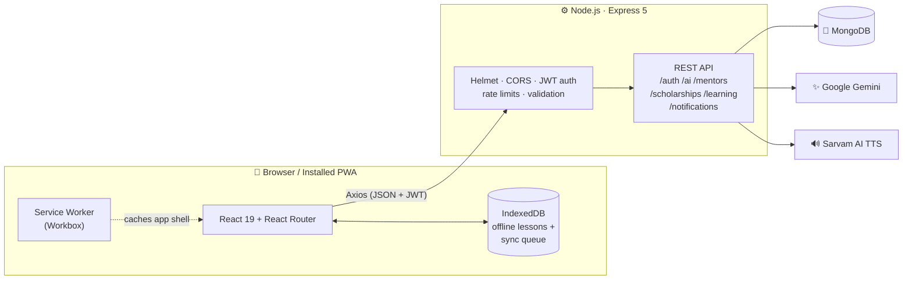

<div align="center">


# ShikshaSetu AI

### *Shiksha* (education) + *Setu* (bridge) — a bridge between every student and quality learning.

A multilingual, offline-first, AI-powered learning platform built for students in rural and Tier-2/3 India — where language, patchy internet and lack of guidance shouldn't decide who gets to learn.

<br />


<br />

[**✨ Features**](#-features) &nbsp;·&nbsp;
[**🏗️ Architecture**](#️-architecture) &nbsp;·&nbsp;
[**🚀 Quick Start**](#-quick-start) &nbsp;·&nbsp;
[**🔌 API**](#-api-reference) &nbsp;·&nbsp;
[**☁️ Deploy**](#️-deployment)

</div>

---

## 💡 The Problem

Millions of students have a phone but not the rest of what learning needs:

| 🗣️ Language barrier | 📶 Unreliable internet | 🧭 No guidance | 💸 Missed opportunities |
| :---: | :---: | :---: | :---: |
| Most quality content is English-only | Online-only apps stop working | No mentor to ask "what next?" | Scholarships go unclaimed because no one knew |

**ShikshaSetu brings all of it into one installable app** — in the student's own language, working even when the network doesn't.

---

## ✨ Features

<table>
<tr>
<td width="50%" valign="top">

### 🤖 AI Tutor
Ask any study question by **text or voice** and get simple, step-by-step answers from **Google Gemini** — in the language you chose. Tap to hear the answer read aloud.

</td>
<td width="50%" valign="top">

### 🌐 8 Indian Languages
English · हिन्दी · मराठी · বাংলা · தமிழ் · తెలుగు · ગુજરાતી · ਪੰਜਾਬੀ — one selection drives lessons, AI answers and voice across the whole app.

</td>
</tr>
<tr>
<td valign="top">

### 📴 Offline-First PWA
Install it like a native app. Download lessons to **IndexedDB**, keep learning without internet, and your progress **auto-syncs** when you're back online.

</td>
<td valign="top">

### 📚 Lessons, Quizzes & Progress
Subject-wise lessons in Maths, Science, Computer and English, with quizzes, learning paths, streaks and a visual progress dashboard.

</td>
</tr>
<tr>
<td valign="top">

### 🧑‍🏫 Mentor Connect
Students discover mentors by subject and language and send connection requests; mentors **accept or reject** from their own dashboard.

</td>
<td valign="top">

### 🎓 Scholarship Finder
Search and filter scholarships by state, category, education level and income — or hit **"Find for me"** for personalised matches.

</td>
</tr>
<tr>
<td valign="top">

### 🧭 AI Career Roadmap
Pick an interest and a goal; Gemini builds a practical roadmap of skills, steps and resources.

</td>
<td valign="top">

### 🔔 Smart Notifications
In-app notification centre plus optional **browser push** reminders (Web Push / VAPID).

</td>
</tr>
</table>

---

## 👥 Roles

| Role | What they can do |
| --- | --- |
| 🎒 **Student** | Learn, take quizzes, use the AI tutor, find scholarships, request mentors, track progress. The default for every sign-up. |
| 🧑‍🏫 **Mentor** | Everything a student sees, plus an inbox to accept or reject student requests and a public mentor profile. |
| 🛡️ **Admin** | Elevated access for managing data. Cannot be self-registered — assigned directly in the database. |

---

## 🏗️ Architecture



<details>
<summary><b>🧰 Full tech stack</b></summary>

<br />

| Layer | Technology |
| --- | --- |
| Frontend | React 19, Vite 8, React Router 7, Axios |
| PWA & offline | `vite-plugin-pwa` (Workbox), IndexedDB |
| Backend | Node.js, Express 5 (ES modules) |
| Database | MongoDB with Mongoose 9 |
| Auth & security | JWT, bcryptjs, Helmet, rate limiting, input validation |
| AI | Google Gemini (`@google/genai`) |
| Speech | Sarvam AI text-to-speech, browser Web Speech API |
| Push | Web Push with VAPID keys |

</details>

<details>
<summary><b>📁 Repository layout</b></summary>

<br />

```text
.
├── backend/
│   ├── scripts/                  # Security smoke tests, mentor seeding
│   └── src/
│       ├── config/               # Database and environment configuration
│       ├── controllers/          # HTTP request handlers
│       ├── middleware/           # Auth, roles, validation, rate limits, errors
│       ├── models/               # Mongoose models
│       ├── routes/               # API route definitions
│       ├── services/             # Learning, notification, reminder, speech logic
│       └── utils/
├── frontend/
│   ├── public/                   # PWA assets and push service worker
│   ├── vercel.json               # SPA rewrites + caching headers
│   └── src/
│       ├── components/           # Toasts, Sarthi assistant, sync manager, ...
│       ├── context/              # Global language state
│       ├── pages/                # One file per route
│       ├── styles/
│       └── utils/                # IndexedDB helpers
└── PROJECT_EXPLANATION.md        # Detailed walkthrough (Hinglish)
```

</details>

---

## 🚀 Quick Start

> **Prerequisites:** Node.js **20.19+** or **22.12+**, npm, and a MongoDB database (local or [Atlas](https://www.mongodb.com/atlas)).
> Gemini and Sarvam keys are optional — the app runs without them, only the AI/voice features are disabled.

**1. Clone and install**

```bash
git clone https://github.com/RajaKumar207-de/ShikshaSetu-AI.git
cd ShikshaSetu-AI

cd backend  && npm install && cd ..
cd frontend && npm install && cd ..
```

**2. Configure environment**

```bash
cp backend/.env.example  backend/.env
cp frontend/.env.example frontend/.env
```

At minimum set `MONGO_URI` and `JWT_SECRET` in `backend/.env`.

**3. Seed demo mentors** *(optional)*

```bash
cd backend && npm run seed:mentors
```

Creates 12 test mentors across all subjects (password `Mentor@123`). Safe to re-run — existing accounts are skipped.

**4. Run** — in two terminals:

```bash
cd backend  && npm run dev     # → http://localhost:5000
cd frontend && npm run dev     # → http://localhost:5173
```

Health check: <http://localhost:5000/api/health>

<details>
<summary><b>🔐 Environment variable reference</b></summary>

<br />

**`backend/.env`**

| Variable | Required | Purpose |
| --- | :---: | --- |
| `MONGO_URI` | ✅ | MongoDB connection string |
| `JWT_SECRET` | ✅ | Signs auth tokens — use 32+ random characters in production |
| `PORT` | | Backend port (default `5000`) |
| `JWT_EXPIRES_IN` | | Token lifetime (default `7d`) |
| `NODE_ENV` | | `production` when deployed |
| `CORS_ORIGINS` | prod | Comma-separated allowed frontend origins (local default `http://localhost:5173`) |
| `TRUST_PROXY` | | `true` only behind a trusted reverse proxy |
| `GEMINI_API_KEY` | | Enables AI tutor and career roadmap |
| `SARVAM_API_KEY` | | Enables text-to-speech |
| `VAPID_PUBLIC_KEY` · `VAPID_PRIVATE_KEY` · `VAPID_SUBJECT` | | Browser push notifications |

**`frontend/.env`**

| Variable | Purpose |
| --- | --- |
| `VITE_API_URL` | Backend base URL, no trailing slash (default `http://localhost:5000`) |

> ⚠️ `VITE_*` values are bundled into browser code — never put secrets in them.

Generate VAPID keys with `npx web-push generate-vapid-keys` inside `backend/`.

</details>

<details>
<summary><b>🧪 Checks</b></summary>

<br />

```bash
cd backend  && npm run test:security   # security smoke tests (auth, roles, ownership)
cd frontend && npm run lint            # oxlint
cd frontend && npm run build           # production build → frontend/dist/
```

</details>

---

## 🔌 API Reference

| Prefix | Purpose |
| --- | --- |
| `/api/auth` | Register, login, current user |
| `/api/ai` | AI tutor, career roadmap, text-to-speech |
| `/api/mentors` | Mentor discovery, profiles, connection requests |
| `/api/scholarships` | Search, details, personalised matching |
| `/api/learning` | Learning events and progress summaries |
| `/api/notifications` | In-app notifications and push subscriptions |
| `/api/health` | Backend and database health |

<details>
<summary><b>Mentor endpoints in detail</b></summary>

<br />

| Method | Endpoint | Access | Description |
| --- | --- | --- | --- |
| `GET` | `/api/mentors` | Public | List mentors |
| `POST` | `/api/mentors/request` | Student | Send a connection request |
| `GET` | `/api/mentors/my-requests` | Student | Requests I've sent |
| `GET` | `/api/mentors/requests` | Mentor | Requests I've received |
| `PATCH` | `/api/mentors/request/:id` | Mentor | Accept or reject |
| `PATCH` | `/api/mentors/profile/:mentorId` | Owner / Admin | Update mentor profile |

</details>

See [`backend/src/routes/`](backend/src/routes/) for every route and its auth requirements.

---

## ☁️ Deployment

- **Frontend** → any static host. A ready [`vercel.json`](frontend/vercel.json) handles SPA routing (no 404 on refresh) and cache headers — set the Vercel root directory to `frontend`.
- **Backend** → any Node.js host, with access to MongoDB.
- Point `VITE_API_URL` at the deployed backend and `CORS_ORIGINS` at the deployed frontend.
- Set `NODE_ENV=production` and a strong `JWT_SECRET` — startup refuses weak production config.
- Serve over **HTTPS**; service workers and push require a secure context.
- Keep every secret in the host's environment-variable store, never in source control.

---

## 🗺️ Roadmap

- [x] Multilingual AI tutor with voice
- [x] Offline lessons with background sync
- [x] Mentor requests with role-based access
- [x] Scholarship matching
- [ ] Live mentor chat / video sessions
- [ ] More subjects and regional-board syllabi
- [ ] Teacher dashboard for classrooms

---

<div align="center">

### 🤝 Contributing

Issues and pull requests are welcome. For bigger changes, please open an issue first to discuss the idea.

<br />

**Built with ❤️ to make learning accessible to every student in India.**

If this project helped or inspired you, consider giving it a ⭐

</div>
